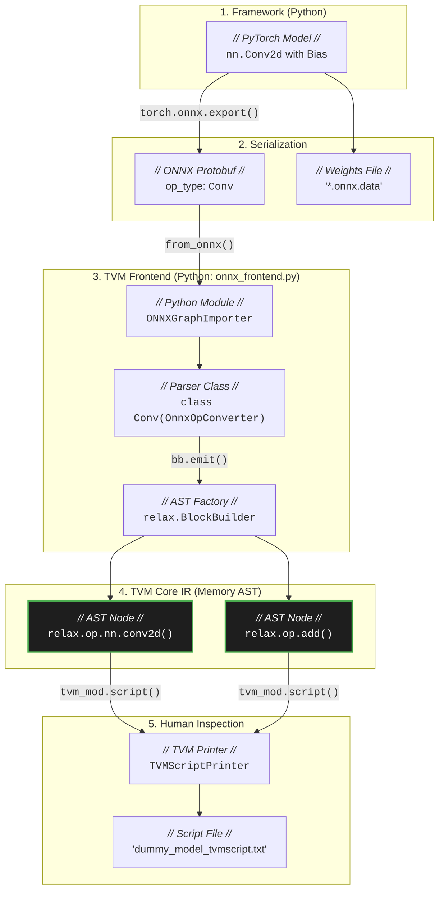
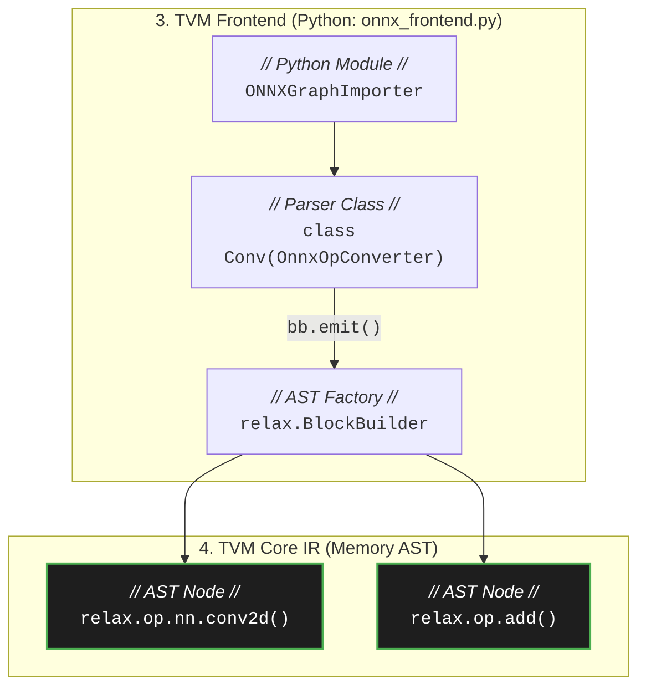
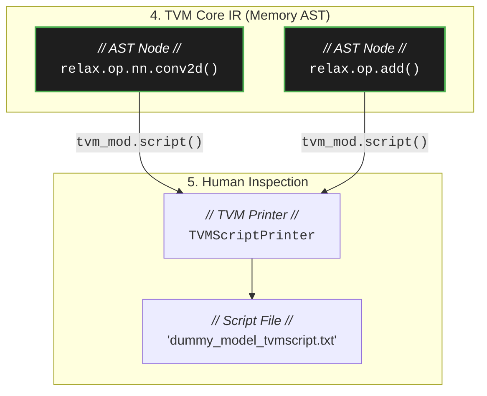

# Python Frontend & AST Construction

When a deep learning model is ingested into TVM, it does not immediately become executable machine code. The compiler must first translate the model into its own internal language: the **Abstract Syntax Tree (AST)**.

This note dissects the `tvm.relax.frontend.onnx.from_onnx()` parsing mechanism, revealing how opaque neural network layers are destructured into explicit TVM AST nodes.

## The Ingestion Pipeline (Data Flow)

To understand the lifecycle of a model as it enters TVM, observe the following data flow. It illustrates how a user-friendly framework operator (like PyTorch's `Conv2d`) is transformed, serialized, and eventually rebuilt into compiler-friendly memory objects.



## The Translation Mechanism

When we call `tvm_mod = from_onnx(onnx_model)`, the TVM frontend does **not** execute any mathematical operations. Instead, it acts as a translator, reading the ONNX Protobuf blueprint and instantiating equivalent TVM AST objects in memory.

### 1. The BlockBuilder (AST Factory)
The core engine of this translation is the `BlockBuilder` (`bb`). It is a factory class responsible for constructing the AST safely. When the parser encounters an ONNX node, it translates the attributes (like strides and padding) and instructs the `BlockBuilder` to "emit" a new node.



### 2. Desugaring: Breaking Down Convenience APIs
In PyTorch, `nn.Conv2d` automatically handles both the matrix multiplication (convolution) and the scalar addition (bias). This is "syntactic sugar" for developer convenience.

However, a compiler demands pure, atomic mathematical primitives to maximize optimization freedom. Therefore, TVM's `Conv` parser explicitly tears this apart (Desugaring). 

By examining the Apache TVM source code (`tvm/python/tvm/relax/frontend/onnx/onnx_frontend.py`), we see the exact moment this happens:

??? abstract "Ground Truth: Source Code Tracing (`class Conv`)"
    [View on GitHub (Commit `a104a7b0`)](https://github.com/apache/tvm/blob/a104a7b0a299103d1e910debcbe63aeafcea045f/python/tvm/relax/frontend/onnx/onnx_frontend.py#L1917-L1971)

    ```python linenums="1917"
            if ndim == 3:
                op = relax.op.nn.conv1d
                data_layout = "NCW"
                kernel_layout = "OIW"
            elif ndim == 4:
                op = relax.op.nn.conv2d # (1)!
                data_layout = "NCHW"
                kernel_layout = "OIHW"
            # ... (padding logic omitted for brevity) ...

            conv_out = bb.normalize(
                op(
                    data=data,
                    weight=inputs[1], # (2)!
                    strides=attr.get("strides", 1),
                    padding=attr.get("pads", 0),
                    dilation=attr.get("dilations", 1),
                    groups=attr.get("group", 1),
                    data_layout=data_layout,
                    kernel_layout=kernel_layout,
                )
            )
            if inputs[2] is not None: # (3)!
                bias = relax.op.reshape(inputs[2], [1, -1] + [1] * (ndim - 2))
                conv_out = relax.op.add(conv_out, bias) # (4)!

            return conv_out
    ```

    1. The parser dynamically selects the appropriate operator (`relax.op.nn.conv2d`) based on input dimensions.
    2. `inputs[1]` represents the weight tensor extracted from the ONNX graph.
    3. `inputs[2]` is the optional bias tensor. The parser explicitly checks if it exists.
    4. If bias exists, the `BlockBuilder` emits a `relax.op.add()` node and chains it to the output of the convolution.

## The Illusion of TVMScript

The file `dummy_model_tvmscript.txt` that we generate is **not** the internal representation; it is a decompiled reflection of it.



After the `BlockBuilder` finishes, the graph exists purely as C++/Python objects in memory (the AST). When we invoke `tvm_mod.script()`, TVM's internal Printer traverses these memory objects and translates them back into a human-readable, Python-like syntax. 

## Deep Dive: Physical Memory Structure (Teaser)

We now understand that `relax.op.nn.conv2d()` and `relax.op.add()` are AST objects constructed in memory by the Python frontend. 

But here lies a critical architectural paradox: **The optimization and code generation engines reside entirely in the C++ core.** 

How does an AST built using Python classes (`tvm.relax.Expr`) seamlessly transmit its complex graph topology to the C++ engine without undergoing catastrophic serialization overhead? What physical shape do these "abstract data types" actually take in memory?

This paradox leads us directly to the memory boundary—the **FFI (Foreign Function Interface)**—which we will dissect in the next step.
