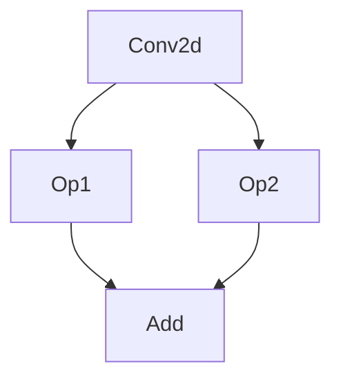

# C++ Architecture: Operator Fusion and Pattern Matching

This note dissects the C++ implementation of the `FuseOps` compiler pass, explaining how TVM algorithmically decides which nodes can be fused together.

## The Fusion Challenge

In a massive Dataflow graph (like ResNet or LLaMA), the compiler cannot simply fuse operations blindly. It must handle complex branching (Diamond Shapes) safely. For example:

If the compiler greedily fuses `Conv2d` to `Op1`, it might break the path to `Op2`. To solve this, `tvm/src/relax/transform/fuse_ops.cc` employs **Post-Dominator Analysis**.

### Post-Dominator Trees
The algorithm constructs a DAG and a Post-Dominator tree. The immediate post-dominator of a node is the closest downstream node where *all future paths* eventually merge (e.g., `Add` is the post-dominator of `Conv2d` in the diagram above). A node can only be fused if all paths to its post-dominator satisfy the fusion conditions.

## The `OpPatternKind` Classification

How does TVM know that `Conv2d` and `Add` are compatible for fusion, but two `Conv2d` layers are not?

TVM classifies every atomic operator using an `OpPatternKind` (`tvm/include/tvm/relax/op_attr_types.h`). This acts as the operator's genetic signature:

1. **`kElemWise` (0)**: Elementwise operations (e.g., `Add`, `ReLU`).
2. **`kBroadcast` (1)**: Operations that broadcast dimensions.
3. **`kInjective` (2)**: 1-to-1 mappings.
4. **`kCommReduce` (3)**: Reductions (e.g., `Sum`).
5. **`kOutEWiseFusable` (4)**: Complex operations that can fuse elementwise ops into their output (e.g., `Conv2d`, `Matmul`).
6. **`kOpaque` (8)**: Un-fusable, strict boundaries.

### The Fusion Rule: `kOutEWiseFusable` -> `kElemWise`

During the `FuseOps` pass, TVM uses a Union-Find data structure to traverse the AST. When it evaluates our `Conv2d -> Add -> ReLU` graph:

1. It identifies `Conv2d` as `kOutEWiseFusable` (a heavy compute kernel).
2. It identifies `Add` and `ReLU` as `kElemWise`.
3. The rules in `fuse_ops.cc` explicitly state that `kOutEWiseFusable` nodes can "absorb" downstream `kElemWise` nodes as long as they are on a direct dominator path.
4. The Union-Find algorithm clusters these three nodes into a single group.

### From Graph to TensorIR (`FuseTIR`)

Once grouped, the `FuseTIR` pass translates this logical group into a single block of C++ nested loops (TensorIR). The boundaries between the operations are erased, and intermediate memory allocations (which would normally trigger heavy DRAM writes) are converted to `sblock_alloc_buffer`, meaning they will exist only in the processor's ultra-fast L1 cache or registers.

---
**Related Execution Log**: [[06_operator_fusion_execution]]
